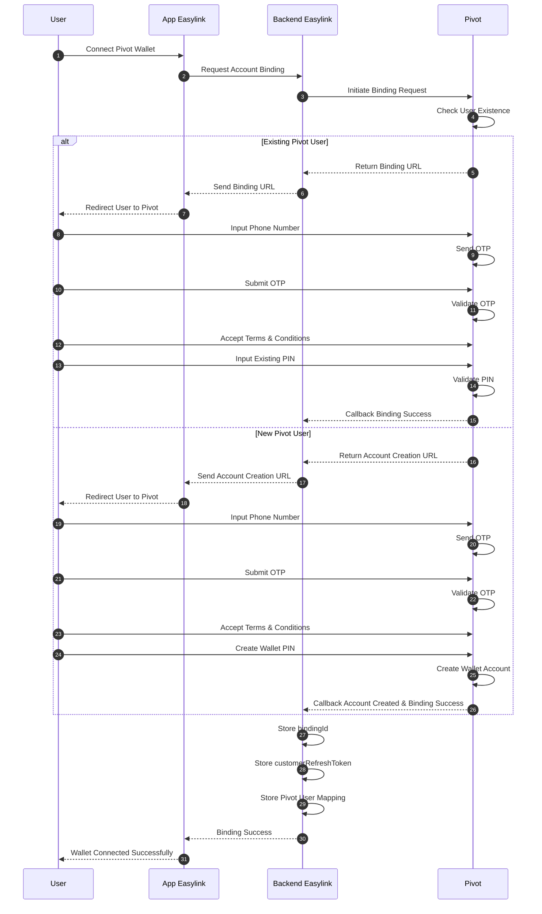

# Easylink Account Creation & Binding Flow using Pivot Wallet

## Overview

This document describes the user account creation and account binding flow between:

- Easylink
- Pivot Wallet Platform

This process is required to:

- connect Easylink users to Pivot Wallet
- allow users to use Pivot wallet services
- enable B2B2C payment flows
- authorize wallet transactions using Pivot

In this architecture:

- User wallet account is created and maintained by Pivot
- Easylink stores binding information and user mapping
- Pivot handles OTP, PIN, authentication, and wallet identity

---

# Architecture Responsibility

| Component | Responsibility |
|---|---|
| Pivot | User wallet account, OTP verification, PIN management, wallet authentication |
| Easylink | User registration flow, binding orchestration, token storage |
| User | OTP verification and PIN setup |

---

# Account Creation & Binding Flow



---

# Important Notes

## 1. Binding is Required for B2B2C Wallet Transactions

This process enables:

- wallet payment
- QRIS payment
- wallet top-up
- merchant payment
- user-level wallet authorization

---

## 2. Easylink Does NOT Manage User Wallet Authentication

Pivot handles:

- OTP verification
- PIN validation
- wallet authentication
- wallet security

Easylink should NEVER store user wallet PIN.

---

## 3. Binding Result Must Be Stored Securely

After successful binding, Easylink should store:

```text
bindingId
customerToken
customerRefreshToken
pivotUserId
```

---

# Recommended Database Table

## pivot_user_bindings

| Field | Description |
|---|---|
| id | Internal record ID |
| user_id | Easylink user ID |
| pivot_user_id | Pivot wallet user ID |
| binding_id | Pivot binding identifier |
| customer_token | Pivot customer token |
| customer_refresh_token | Pivot refresh token |
| status | ACTIVE / INACTIVE |
| created_at | Timestamp |
| updated_at | Timestamp |

---

# Authentication Flow

## B2B Authentication

Used for:

- merchant-level requests
- payment configuration
- payment creation
- top-up channel requests

---

## B2B2C Authentication

Used for:

- wallet user authorization
- user wallet payment
- user-level wallet transactions

Example:

```text
POST /open-api/v1/access-token/b2b2c
```

Using:

```text
bindingId
customerRefreshToken
```

to generate:

```text
customer access token
```

---

# Recommended Best Practices

- Encrypt refresh tokens in database
- Never expose refresh token to frontend
- Implement token refresh mechanism
- Store callback audit logs
- Validate all callbacks from Pivot
- Separate Easylink user identity and Pivot wallet identity

---

# Key Principle

```text
Pivot = Source of truth for wallet identity and balance
Easylink = Source of truth for application user identity
```

---

# Conclusion

This architecture provides:

- secure user wallet onboarding
- centralized wallet management by Pivot
- scalable B2B2C wallet integration
- secure user authentication and payment authorization
