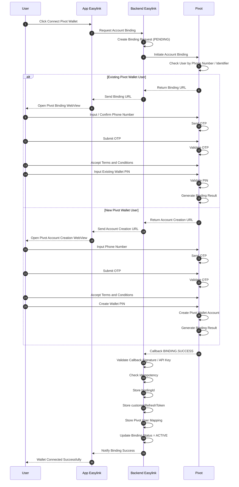
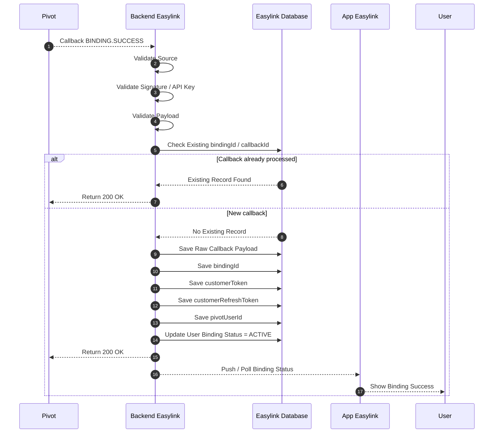

# Easylink Account Binding Flow with Pivot Callback

## Overview

This document describes the Account Binding flow between:

- Easylink User
- Easylink App
- Easylink Backend
- Pivot Wallet Platform

This flow is required before a user can use Pivot wallet features such as:

- wallet balance
- top-up
- QRIS payment
- merchant payment
- H2H payment
- B2B2C wallet transaction

In this architecture:

- Pivot owns the wallet account
- Pivot manages OTP, PIN, wallet identity, and wallet security
- Easylink owns the application user identity
- Easylink stores the binding result after receiving callback from Pivot

---

# Architecture Responsibility

| Component | Responsibility |
|---|---|
| User | Starts binding, verifies OTP, creates or inputs PIN |
| App Easylink | Opens binding page / webview and shows binding result |
| Backend Easylink | Initiates binding, stores binding result, validates callback |
| Pivot | Checks account, handles OTP, PIN, wallet account, and callback |

---

# Account Binding Sequence Diagram



---

# Callback Sequence Diagram



---

# Binding Callback Payload Example

```json
{
  "event": "BINDING.SUCCESS",
  "data": {
    "bindingId": "bind_123456789",
    "pivotUserId": "pivot_user_123",
    "customerToken": "customer_token_value",
    "customerRefreshToken": "customer_refresh_token_value",
    "status": "ACTIVE"
  }
}
```

> The exact payload fields must follow Pivot's official callback specification.

---

# Data That Easylink Must Store

| Field | Description |
|---|---|
| user_id | Easylink internal user ID |
| pivot_user_id | Pivot wallet user ID |
| binding_id | Pivot binding identifier |
| customer_token | Customer token from Pivot, if provided |
| customer_refresh_token | Refresh token used to generate B2B2C access token |
| binding_status | PENDING / ACTIVE / FAILED / UNBOUND |
| raw_callback | Original callback payload for audit |

---

# Recommended Database Table

## pivot_user_bindings

| Field | Description |
|---|---|
| id | Internal record ID |
| user_id | Easylink user ID |
| pivot_user_id | Pivot user ID |
| binding_id | Pivot binding ID |
| customer_token | Pivot customer token |
| customer_refresh_token | Pivot customer refresh token |
| status | PENDING / ACTIVE / FAILED / UNBOUND |
| created_at | Timestamp |
| updated_at | Timestamp |

---

## pivot_binding_callbacks

| Field | Description |
|---|---|
| id | Internal callback ID |
| user_id | Easylink user ID |
| binding_id | Pivot binding ID |
| event | BINDING.SUCCESS / BINDING.FAILED |
| payload | Raw callback payload |
| received_at | Timestamp |

---

# Status Lifecycle

```text
PENDING
→ ACTIVE
```

Failure flow:

```text
PENDING
→ FAILED
```

Unbinding flow:

```text
ACTIVE
→ UNBOUND
```

---

# Important Rules

## 1. Do Not Trust Frontend Redirect Alone

The frontend redirect is only for user experience.

Easylink must mark binding as successful only after receiving a valid callback from Pivot.

---

## 2. Callback Must Be Idempotent

Pivot may send callback more than once.

Easylink must prevent duplicate processing by checking:

- bindingId
- callbackId, if available
- event type
- user mapping

---

## 3. Store Refresh Token Securely

`customerRefreshToken` is sensitive.

Recommended:

- encrypt before storing
- never expose to frontend
- rotate if Pivot supports token rotation

---

# Usage After Binding

After binding is active, Easylink can generate B2B2C access token using:

```text
bindingId
customerRefreshToken
```

This B2B2C token is used for user-level wallet transactions.

---

# Key Principle

```text
Pivot = Source of truth for wallet identity, PIN, and wallet account
Easylink = Source of truth for app user identity and binding status
```

---

# Conclusion

Account Binding connects an Easylink user to a Pivot wallet account.

The binding is considered valid only after Pivot sends a successful callback and Easylink stores the binding result securely.
