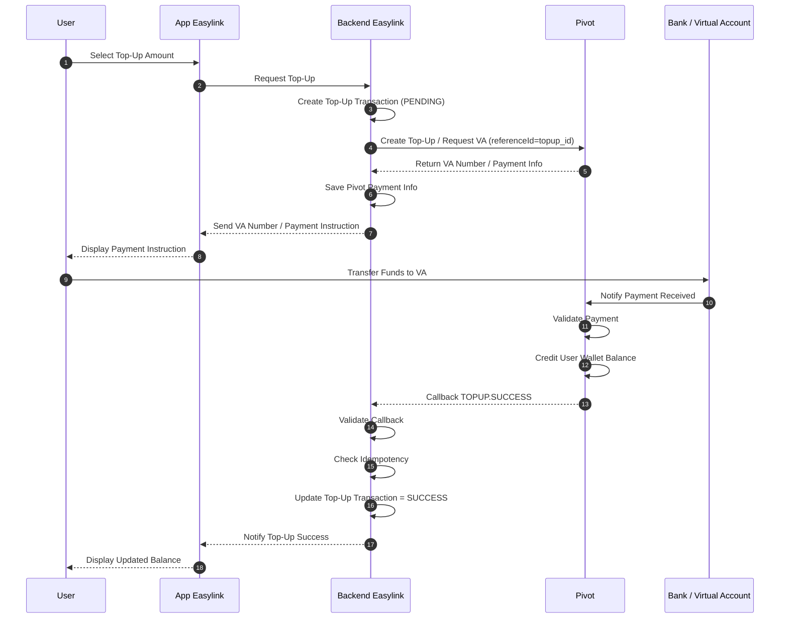

# Easylink User Top-Up Flow using Pivot Open Loop Wallet

## Overview

This document describes the asynchronous user top-up flow using:

- Pivot Open Loop Wallet
- Easylink as Merchant
- Bank / Virtual Account as payment channel

In this architecture:

- User wallet balance is maintained by Pivot
- Easylink does NOT maintain user wallet balance
- User top-up balance is credited inside Pivot
- Easylink only records top-up status after receiving callback from Pivot

---

# Architecture Responsibility

| Component | Responsibility |
|---|---|
| Pivot | User wallet balance, top-up processing, VA/payment channel, balance credit |
| Easylink | Top-up request, transaction tracking, callback validation |
| Bank / VA | Payment collection channel |
| User | Initiates and pays top-up |

---

# User Top-Up Flow



---

# Important Notes

## 1. Top-Up is Asynchronous

Easylink MUST wait for:

```text
TOPUP.SUCCESS callback
```

before marking the top-up as successful.

---

## 2. User Balance is Managed by Pivot

Easylink does NOT:

- credit user balance
- maintain wallet ledger
- manually update user wallet balance

All wallet balance updates happen inside Pivot.

---

## 3. Easylink is the Source of Truth for Top-Up Status

Pivot handles:

- payment collection
- wallet balance credit
- top-up confirmation

Easylink handles:

- top-up request lifecycle
- transaction status tracking
- callback validation
- audit log

---

# Top-Up Status Lifecycle

```text
PENDING
→ SUCCESS
```

Failure / expiry flow:

```text
PENDING
→ FAILED

or

PENDING
→ EXPIRED
```

---

# Recommended Database Tables

## topup_transactions

| Field | Description |
|---|---|
| id | Internal top-up ID |
| user_id | Easylink user ID |
| reference_id | Top-up reference ID sent to Pivot |
| pivot_transaction_id | Pivot transaction ID, if available |
| va_number | Virtual Account number, if available |
| amount | Top-up amount |
| status | PENDING / SUCCESS / FAILED / EXPIRED |
| created_at | Timestamp |
| updated_at | Timestamp |

---

## pivot_callbacks

| Field | Description |
|---|---|
| id | Callback ID |
| reference_id | Pivot reference ID |
| event | TOPUP.SUCCESS / TOPUP.FAILED |
| payload | Raw callback payload |
| received_at | Callback received timestamp |

---

# Recommended Best Practices

- Validate Pivot callback signature or API key
- Use idempotency checks before updating status
- Store raw callback payload for audit
- Do not mark top-up as successful before callback
- Use `reference_id` or `topup_id` as the main transaction mapping key
- Reconcile top-up records with Pivot reports periodically

---

# Key Principle

```text
Pivot = Source of truth for user wallet balance
Easylink = Source of truth for top-up transaction status
```

---

# Conclusion

This architecture provides:

- asynchronous and safe top-up processing
- centralized wallet balance management in Pivot
- clear transaction tracking in Easylink
- reduced risk of double credit or incorrect balance update
