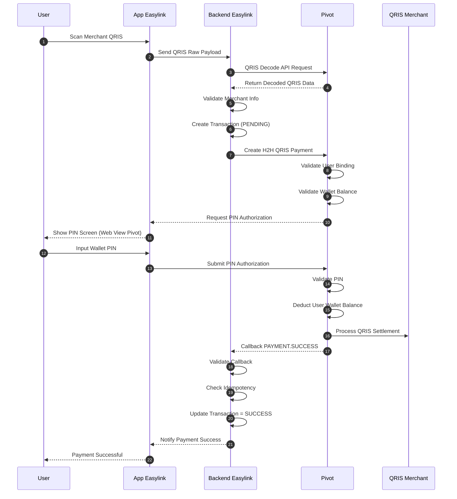

# Easylink QRIS Decode H2H Payment Flow using Pivot Wallet

## Overview

This document describes the Host-to-Host (H2H) QRIS payment flow using:

- Easylink Mobile Application
- Pivot Wallet Platform
- QRIS Decode API
- H2H QRIS Payment Endpoint

In this architecture:

- User scans merchant QRIS using Easylink app
- Easylink decodes QRIS using Pivot Decode API
- Easylink initiates H2H QRIS payment
- Pivot deducts user wallet balance
- Pivot processes QRIS payment settlement
- Easylink manages transaction orchestration and callback handling

This flow uses:

- B2B2C authentication
- Pivot wallet balance
- asynchronous payment callback processing

---

# Architecture Responsibility

| Component | Responsibility |
|---|---|
| Pivot | QRIS decode, wallet balance validation, PIN validation, QRIS payment execution |
| Easylink | QRIS scan orchestration, transaction lifecycle, callback handling |
| QRIS Merchant | Payment receiver |
| User | QRIS scan and payment authorization |

---

# QRIS Decode H2H Payment Flow

---

# Detailed Flow Explanation

## 1. QRIS Scan

User scans merchant QRIS using Easylink application.

The QRIS raw payload is sent to Easylink backend.

---

## 2. QRIS Decode

Easylink backend calls Pivot QRIS Decode API.

Pivot returns:

- merchant name
- merchant category
- payment amount (if dynamic QRIS)
- acquirer info
- terminal info

---

## 3. Transaction Initialization

Easylink:

- validates merchant information
- creates internal transaction record
- generates reference ID

Transaction status:

PENDING

---

## 4. H2H Payment Request

Easylink calls Pivot H2H payment endpoint.

Pivot validates:

- user wallet binding
- wallet status
- wallet balance
- transaction eligibility

---

## 5. PIN Authorization

User authorizes payment using Pivot wallet PIN.

PIN validation is handled entirely by Pivot.

Easylink MUST NOT store wallet PIN.

---

## 6. Wallet Deduction & Settlement

Pivot:

- deducts user wallet balance
- processes QRIS settlement
- transfers funds to merchant acquirer

---

## 7. Asynchronous Callback

Pivot sends callback:

PAYMENT.SUCCESS

Easylink then:

- validates callback
- checks idempotency
- updates transaction status

---

# Important Notes

## 1. Wallet Balance is Managed by Pivot

Pivot is the source of truth for:

- wallet balance
- PIN validation
- payment authorization
- QRIS settlement

Easylink should NOT directly deduct user balance.

---

## 2. Payment Flow is Asynchronous

Easylink MUST wait for callback before:

- marking payment successful
- updating transaction state
- showing final success state

---

## 3. H2H Flow

This is direct server-to-server communication:

Easylink Backend ↔ Pivot Backend

without redirection payment pages.

---

# Transaction Status Lifecycle

PENDING
→ SUCCESS

Failure flow:

PENDING
→ FAILED

---

# Recommended Database Tables

## qris_transactions

| Field | Description |
|---|---|
| id | Internal transaction ID |
| user_id | Easylink user ID |
| reference_id | Easylink transaction reference |
| pivot_transaction_id | Pivot transaction ID |
| merchant_name | QRIS merchant name |
| amount | Payment amount |
| status | PENDING / SUCCESS / FAILED |
| created_at | Timestamp |
| updated_at | Timestamp |

---

## pivot_callbacks

| Field | Description |
|---|---|
| id | Callback ID |
| reference_id | Easylink reference ID |
| event | PAYMENT.SUCCESS / PAYMENT.FAILED |
| payload | Raw callback payload |
| received_at | Timestamp |

---

# Recommended Best Practices

- Validate callback signature
- Implement idempotency validation
- Store raw callback payloads
- Separate QRIS transaction status and settlement status
- Use retry-safe transaction processing
- Implement timeout monitoring
- Audit all H2H payment requests

---

# Security Recommendations

- Never expose Pivot access token to frontend
- Never store user wallet PIN
- Encrypt refresh tokens
- Use HTTPS/TLS for all H2H requests
- Log all critical payment events

---

# Authentication Requirement

## B2B Authentication

Used for:

- QRIS decode request
- QRIS payment initialization

---

## B2B2C Authentication

Used for:

- user wallet authorization
- wallet deduction
- PIN authorization
- QRIS payment execution

---

# Key Principle

Pivot = Source of truth for wallet balance and QRIS payment execution

Easylink = Source of truth for transaction orchestration and application transaction history

---

# Conclusion

This architecture provides:

- secure QRIS H2H payment processing
- direct QRIS payment execution
- centralized wallet balance management by Pivot
- scalable B2B2C QRIS integration
- asynchronous callback-driven payment confirmation
