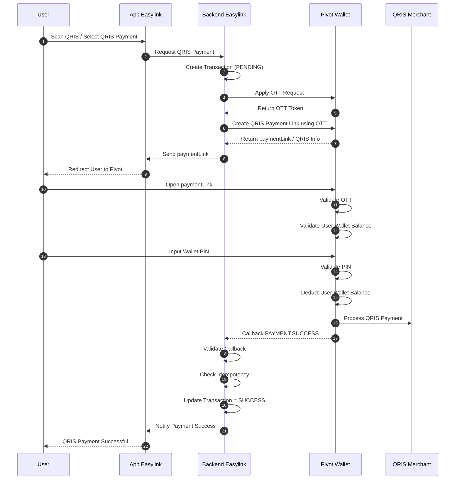

# Easylink QRIS Payment Link Flow using Pivot Wallet (Apply OTT)

## Overview

This document describes the QRIS Payment Link flow using:

- Easylink as Merchant Platform
- Pivot Wallet Platform
- QRIS Payment Link with OTT (One-Time Token)

This architecture allows Easylink users to:

- generate QRIS payment links
- authorize wallet payments securely
- perform QRIS transactions using Pivot wallet
- use OTT-based authorization flow

In this architecture:

- User wallet balance is maintained by Pivot
- Easylink manages transaction orchestration
- Pivot handles payment authorization and balance deduction
- OTT is used as temporary secure authorization token

---

# Architecture Responsibility

| Component | Responsibility |
|---|---|
| Pivot | Wallet balance, OTT generation, QRIS payment processing, PIN validation |
| Easylink | Transaction orchestration, QRIS request initiation, callback handling |
| User | Payment authorization and PIN confirmation |

---

# QRIS Payment Link Flow (Apply OTT)



---

# Important Notes

## 1. OTT (One-Time Token)

OTT is a temporary authorization token used to:

- secure QRIS payment requests
- authorize user-level transactions
- prevent replay attacks
- validate transaction ownership

OTT is typically:

- short-lived
- single-use
- generated by Pivot

---

## 2. Payment Processing is Asynchronous

Easylink MUST wait for:

```text
PAYMENT.SUCCESS callback
```

before marking the QRIS payment as successful.

---

## 3. User Wallet Balance is Managed by Pivot

Pivot handles:

- wallet balance validation
- PIN authentication
- wallet balance deduction
- QRIS settlement

Easylink should NOT directly deduct user balance.

---

# Recommended Database Tables

## qris_transactions

| Field | Description |
|---|---|
| id | Internal transaction ID |
| user_id | Easylink user ID |
| reference_id | Easylink transaction reference |
| pivot_transaction_id | Pivot transaction ID |
| ott_token | One-Time Token |
| amount | Transaction amount |
| status | PENDING / SUCCESS / FAILED |
| created_at | Timestamp |
| updated_at | Timestamp |

---

## pivot_callbacks

| Field | Description |
|---|---|
| id | Callback ID |
| reference_id | Easylink reference ID |
| event | PAYMENT.SUCCESS / PAYMENT.FAILED |
| payload | Raw callback payload |
| received_at | Timestamp |

---

# Authentication Requirement

## B2B Authentication

Used for:

- merchant-level requests
- OTT generation requests
- QRIS payment initialization

---

## B2B2C Authentication

Used for:

- user wallet authorization
- QRIS payment execution
- PIN validation flow

---

# Recommended Best Practices

- Store OTT securely
- Validate OTT expiration before usage
- Implement callback signature verification
- Use idempotency checks
- Never process payment status without callback validation
- Store all raw callbacks for audit purposes
- Separate payment status and settlement status

---

# Transaction Status Lifecycle

```text
PENDING
→ SUCCESS
```

Failure scenario:

```text
PENDING
→ FAILED
```

---

# Key Principle

```text
Pivot = Source of truth for wallet balance and QRIS payment execution
Easylink = Source of truth for transaction orchestration and application flow
```

---

# Conclusion

This architecture provides:

- secure QRIS payment authorization
- OTT-based transaction security
- asynchronous payment processing
- centralized wallet management by Pivot
- scalable B2B2C QRIS wallet integration
