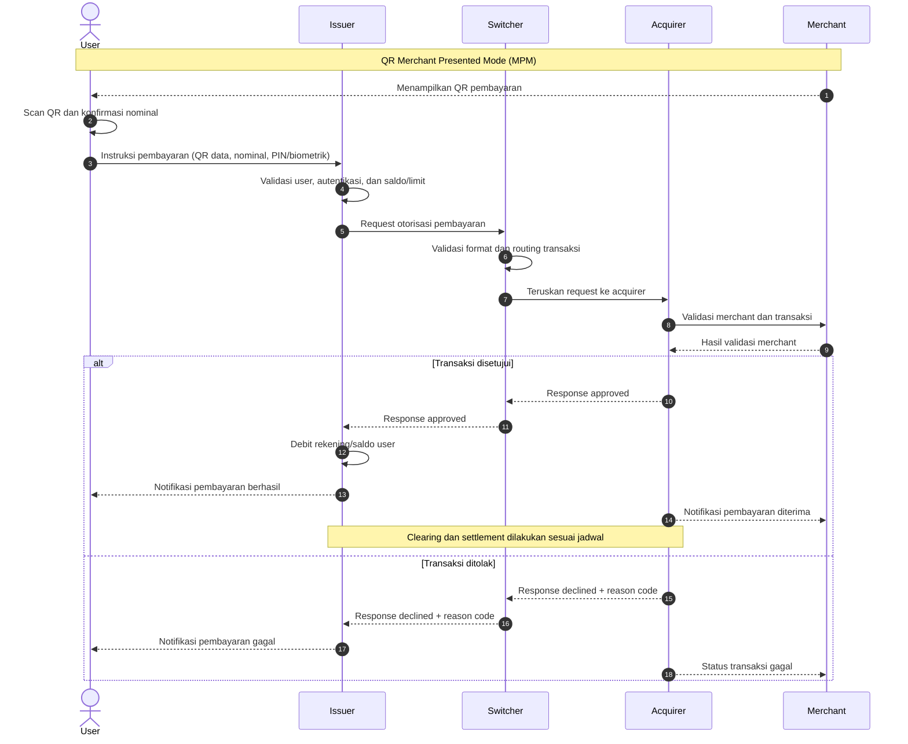

# Diagram Sequence Flow QR Standar

Catatan: diagram menggunakan skenario **Merchant Presented Mode (MPM)**. Detail validasi, notifikasi, clearing, dan settlement dapat berbeda sesuai skema QR dan implementasi penyelenggara.
