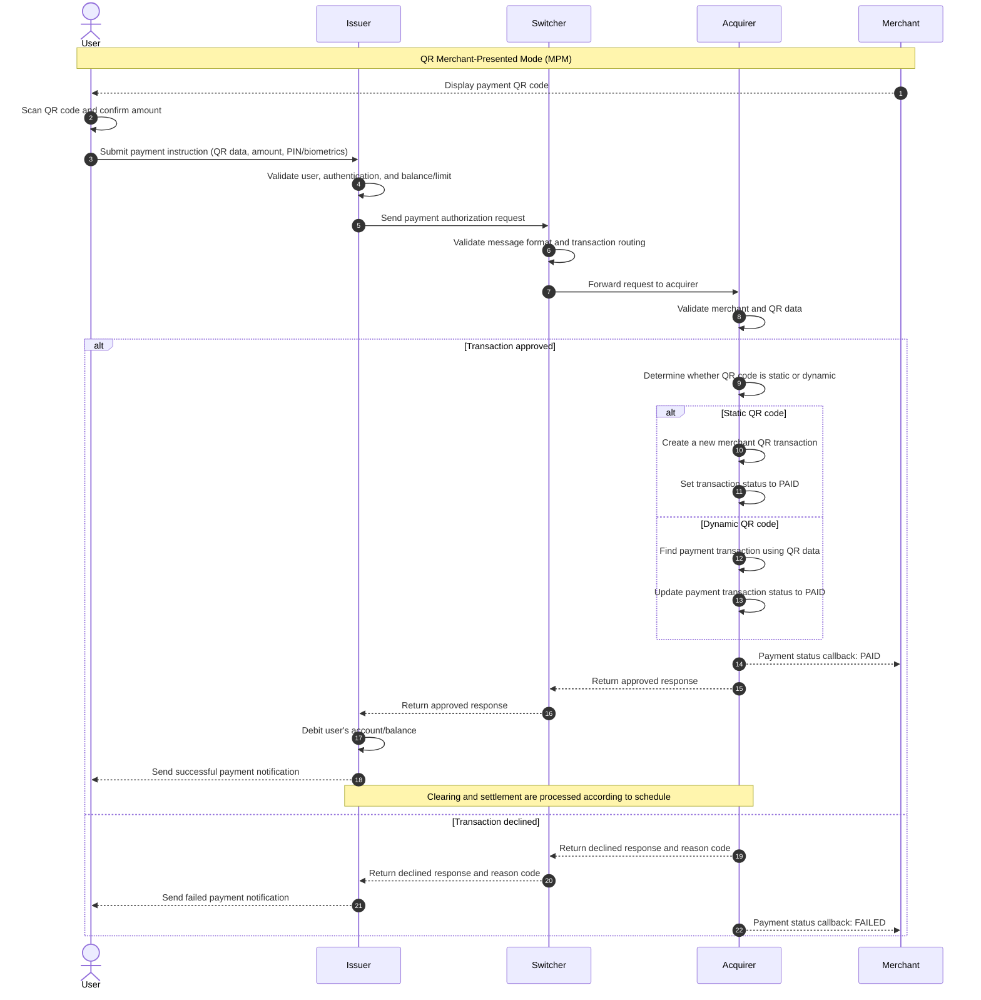

# Standard QR Payment Sequence Diagram

Note: This diagram uses the **Merchant-Presented Mode (MPM)** scenario. The Acquirer processes the transaction according to the QR code type, while the Merchant only receives payment status callbacks from the Acquirer. Validation, notification, clearing, and settlement details may vary depending on the QR payment scheme and provider implementation.
