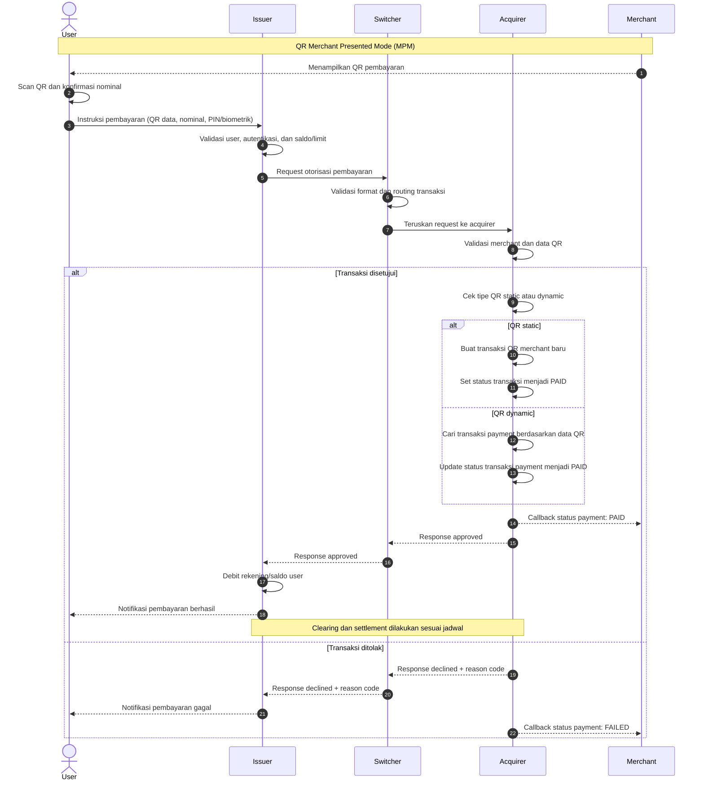

# Diagram Sequence Flow QR Standar

Catatan: diagram menggunakan skenario **Merchant Presented Mode (MPM)**. Acquirer memproses transaksi berdasarkan tipe QR, sedangkan Merchant hanya menerima callback status payment dari Acquirer. Detail validasi, notifikasi, clearing, dan settlement dapat berbeda sesuai skema QR dan implementasi penyelenggara.
