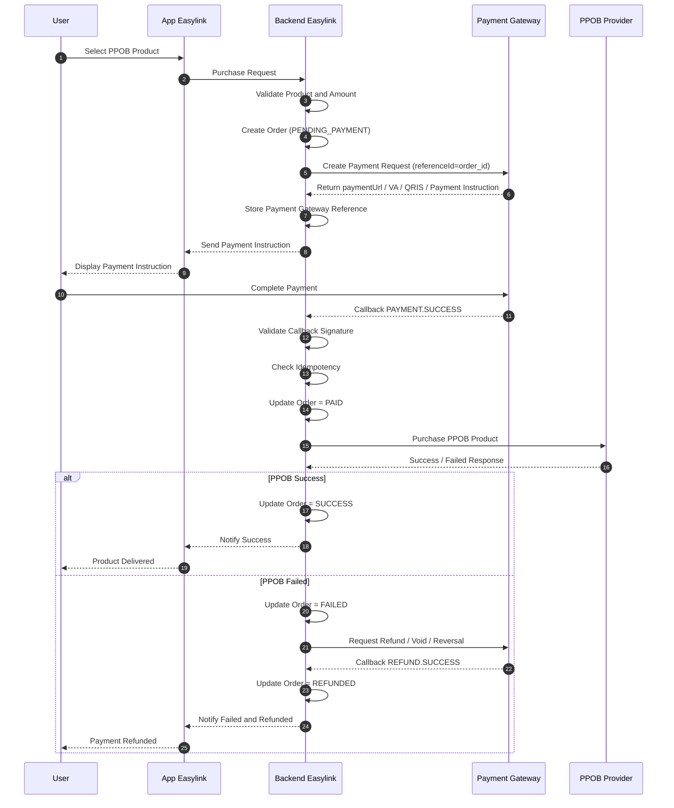

# PPOB Purchase Flow using Payment Gateway without Pivot

## Overview

This document describes the PPOB purchase flow when the user pays using an external payment gateway instead of Pivot Wallet.

In this model:

- Easylink owns the PPOB order
- Payment Gateway handles customer payment collection
- Easylink does not deduct Pivot wallet balance
- PPOB is processed only after payment gateway callback confirms payment success
- Payment status must be asynchronous and callback-driven

---

# Architecture Responsibility

| Component | Responsibility |
|---|---|
| User | Selects PPOB product and completes payment |
| App Easylink | Displays product, payment instruction, and transaction result |
| Backend Easylink | Creates order, creates payment, validates callback, triggers PPOB |
| Payment Gateway | Collects payment via VA / QRIS / e-wallet / card |
| PPOB Provider | Fulfills PPOB product purchase |

---

# PPOB Purchase Sequence Diagram



---

# Recommended Tables

## payment_orders

| Field | Description |
|---|---|
| id | Internal order ID |
| user_id | Easylink user ID |
| reference_id | Unique Easylink order reference |
| transaction_type | PPOB |
| amount | Transaction amount |
| currency | Currency, for example IDR |
| status | PENDING_PAYMENT / PAID / SUCCESS / FAILED / REFUNDED / EXPIRED |
| paid_at | Payment success timestamp |
| expired_at | Payment expiry timestamp |
| created_at | Timestamp |
| updated_at | Timestamp |

---

## payment_gateway_transactions

| Field | Description |
|---|---|
| id | Internal payment gateway transaction ID |
| payment_order_id | Related Easylink order ID |
| gateway_name | Payment gateway provider name |
| gateway_reference_id | Reference ID from payment gateway |
| payment_method | VA / QRIS / EWALLET / CARD |
| payment_url | Redirect URL or payment page URL |
| va_number | Virtual Account number, if any |
| amount | Payment amount |
| status | PENDING / PAID / FAILED / EXPIRED / REFUNDED |
| expired_at | Payment expiry time |
| paid_at | Payment success timestamp |
| created_at | Timestamp |
| updated_at | Timestamp |

---

## payment_gateway_callbacks

| Field | Description |
|---|---|
| id | Internal callback ID |
| gateway_name | Payment gateway provider name |
| gateway_reference_id | Payment gateway transaction reference |
| reference_id | Easylink order reference ID |
| event | PAYMENT.SUCCESS / PAYMENT.FAILED / REFUND.SUCCESS |
| raw_payload | Original callback payload |
| received_at | Timestamp |

---

## ppob_transactions

| Field | Description |
|---|---|
| id | Internal PPOB transaction ID |
| payment_order_id | Related payment order ID |
| provider_reference_id | PPOB provider transaction reference |
| product_code | PPOB product code |
| destination_number | Customer number / phone number |
| amount | PPOB product amount |
| status | PENDING / SUCCESS / FAILED |
| provider_response | Raw response from PPOB provider |
| processed_at | PPOB processing timestamp |
| created_at | Timestamp |
| updated_at | Timestamp |

---

# Status Lifecycle

## Success Flow

```text
PENDING_PAYMENT
→ PAID
→ SUCCESS
```

## Failed PPOB with Refund

```text
PENDING_PAYMENT
→ PAID
→ FAILED
→ REFUND_REQUESTED
→ REFUNDED
```

## Expired Payment

```text
PENDING_PAYMENT
→ EXPIRED
```

---

# Key Difference: Pivot Wallet vs Payment Gateway

| Aspect | Pivot Wallet Flow | Payment Gateway Flow |
|---|---|---|
| User balance | Stored in Pivot | Not used |
| Payment source | Pivot wallet balance | Bank / VA / QRIS / e-wallet / card |
| Balance deduction | Pivot | Payment Gateway / Bank channel |
| PIN validation | Pivot PIN | Usually not required |
| Callback source | Pivot | Payment Gateway |
| PPOB trigger | After Pivot payment callback | After Payment Gateway callback |

---

# Recommended Best Practices

- Validate payment gateway callback signature
- Use idempotency key for every callback
- Never process PPOB before `PAYMENT.SUCCESS`
- Store raw callback payloads for audit
- Separate payment status and PPOB fulfillment status
- Add retry mechanism for PPOB provider timeout
- Add reconciliation job between Easylink and payment gateway
- Add refund workflow for paid orders with failed PPOB fulfillment

---

# Key Principle

```text
Payment Gateway = source of truth for payment collection
Easylink = source of truth for PPOB order lifecycle
PPOB Provider = source of truth for product fulfillment
```

---

# Conclusion

This flow is suitable when Easylink wants to sell PPOB products using external payment channels without using Pivot wallet balance.
